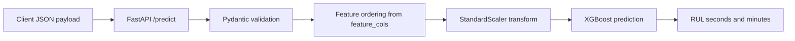

# RUL Prediction API

`rul-prediction-api` is a small FastAPI service that serves a trained XGBoost model for Remaining Useful Life prediction of industrial bearings. The model was trained separately on FEMTO bearing vibration data and is loaded from `models/xgb_rul_femto.pkl`; the API accepts 44 pre-engineered horizontal and vertical vibration features and returns predicted RUL in seconds and minutes.

Companion training repository: [bearing-rul-prediction](https://github.com/mahdimhz/bearing-rul-prediction)

## What It Serves

| Item | Value |
| --- | --- |
| Model file | `models/xgb_rul_femto.pkl` |
| Model type | XGBoost regressor |
| Dataset family | FEMTO bearing vibration data |
| Input | 44 named engineered features |
| Preprocessing | Fitted `StandardScaler` from the model bundle |
| Raw model output | Normalized RUL in `[0, 1]` |
| Returned output | RUL seconds and minutes |
| Negative prediction handling | Clamped to `0.0` seconds |

The model bundle is expected to contain:

| Key | Meaning |
| --- | --- |
| `model` | Trained `XGBRegressor` |
| `scaler` | Fitted `StandardScaler` for 44 features |
| `max_rul` | Maximum RUL scale, `28020.0` seconds |
| `feature_cols` | Ordered list of 44 feature names |

## API Flow



## Endpoints

| Method | Path | Purpose |
| --- | --- | --- |
| `GET` | `/health` | Confirms the API and model are available |
| `POST` | `/predict` | Predicts bearing RUL from 44 named features |
| `GET` | `/docs` | Interactive OpenAPI documentation |

## How To Run

Prerequisites:

| Requirement | Notes |
| --- | --- |
| Docker Desktop | Must be running before starting the API |
| Model file | Place `xgb_rul_femto.pkl` inside `models/` |

Clone the repository:

```bash
git clone https://github.com/mahdimhz/rul-prediction-api.git
cd rul-prediction-api
mkdir -p models
```

Place the trained model here:

```text
models/xgb_rul_femto.pkl
```

Start the API:

```bash
docker compose up --build
```

Open the interactive docs:

```text
http://localhost:8000/docs
```

## Example: Health Check

Request:

```bash
curl http://localhost:8000/health
```

Expected response:

```json
{
  "status": "ok",
  "model": "xgb_rul_femto",
  "n_features": 44
}
```

## Example: Predict RUL

Request:

```bash
curl -X POST http://localhost:8000/predict \
  -H "Content-Type: application/json" \
  -d '{
    "ch_h_rms": 0.0,
    "ch_h_mean": 0.0,
    "ch_h_std": 0.0,
    "ch_h_kurtosis": 0.0,
    "ch_h_skewness": 0.0,
    "ch_h_peak": 0.0,
    "ch_h_crest_factor": 0.0,
    "ch_h_peak_to_peak": 0.0,
    "ch_h_shape_factor": 0.0,
    "ch_h_spectral_mean": 0.0,
    "ch_h_spectral_std": 0.0,
    "ch_h_spectral_kurtosis": 0.0,
    "ch_h_dominant_freq": 0.0,
    "ch_h_total_power": 0.0,
    "ch_h_band_1_energy": 0.0,
    "ch_h_band_2_energy": 0.0,
    "ch_h_band_3_energy": 0.0,
    "ch_h_band_4_energy": 0.0,
    "ch_h_env_mean": 0.0,
    "ch_h_env_std": 0.0,
    "ch_h_env_kurtosis": 0.0,
    "ch_h_env_rms": 0.0,
    "ch_v_rms": 0.0,
    "ch_v_mean": 0.0,
    "ch_v_std": 0.0,
    "ch_v_kurtosis": 0.0,
    "ch_v_skewness": 0.0,
    "ch_v_peak": 0.0,
    "ch_v_crest_factor": 0.0,
    "ch_v_peak_to_peak": 0.0,
    "ch_v_shape_factor": 0.0,
    "ch_v_spectral_mean": 0.0,
    "ch_v_spectral_std": 0.0,
    "ch_v_spectral_kurtosis": 0.0,
    "ch_v_dominant_freq": 0.0,
    "ch_v_total_power": 0.0,
    "ch_v_band_1_energy": 0.0,
    "ch_v_band_2_energy": 0.0,
    "ch_v_band_3_energy": 0.0,
    "ch_v_band_4_energy": 0.0,
    "ch_v_env_mean": 0.0,
    "ch_v_env_std": 0.0,
    "ch_v_env_kurtosis": 0.0,
    "ch_v_env_rms": 0.0
  }'
```

Response shape:

```json
{
  "predicted_rul_seconds": 0.0,
  "predicted_rul_minutes": 0.0,
  "n_features_received": 44
}
```

The numeric prediction depends on the trained model and input feature values.

## Feature Groups

| Group | Count | Features |
| --- | ---: | --- |
| Horizontal time-domain | 9 | `ch_h_rms`, `ch_h_mean`, `ch_h_std`, `ch_h_kurtosis`, `ch_h_skewness`, `ch_h_peak`, `ch_h_crest_factor`, `ch_h_peak_to_peak`, `ch_h_shape_factor` |
| Horizontal spectral | 9 | `ch_h_spectral_mean`, `ch_h_spectral_std`, `ch_h_spectral_kurtosis`, `ch_h_dominant_freq`, `ch_h_total_power`, `ch_h_band_1_energy`, `ch_h_band_2_energy`, `ch_h_band_3_energy`, `ch_h_band_4_energy` |
| Horizontal envelope | 4 | `ch_h_env_mean`, `ch_h_env_std`, `ch_h_env_kurtosis`, `ch_h_env_rms` |
| Vertical time-domain | 9 | `ch_v_rms`, `ch_v_mean`, `ch_v_std`, `ch_v_kurtosis`, `ch_v_skewness`, `ch_v_peak`, `ch_v_crest_factor`, `ch_v_peak_to_peak`, `ch_v_shape_factor` |
| Vertical spectral | 9 | `ch_v_spectral_mean`, `ch_v_spectral_std`, `ch_v_spectral_kurtosis`, `ch_v_dominant_freq`, `ch_v_total_power`, `ch_v_band_1_energy`, `ch_v_band_2_energy`, `ch_v_band_3_energy`, `ch_v_band_4_energy` |
| Vertical envelope | 4 | `ch_v_env_mean`, `ch_v_env_std`, `ch_v_env_kurtosis`, `ch_v_env_rms` |

Total feature count: `44`.

## Response Fields

| Field | Type | Meaning |
| --- | --- | --- |
| `predicted_rul_seconds` | `float` | Predicted remaining useful life in seconds |
| `predicted_rul_minutes` | `float` | Predicted remaining useful life in minutes |
| `n_features_received` | `int` | Number of feature values accepted by the API |

## How To Run Tests

Run the test suite inside Docker:

```bash
docker compose run --rm api pytest tests/ -v
```

Expected result:

```text
4 passed
```

The tests cover:

| Test | Expected behavior |
| --- | --- |
| `test_health` | `/health` returns `200` and `status: ok` |
| `test_predict_zeros` | `/predict` accepts all 44 zero-valued features |
| `test_predict_missing_field` | Missing features return `422` |
| `test_predict_wrong_type` | Non-numeric feature values return `422` |

## Project Structure

```text
rul-prediction-api/
├── app/
│   ├── __init__.py
│   ├── main.py
│   ├── model.py
│   └── schemas.py
├── models/
│   └── xgb_rul_femto.pkl
├── tests/
│   ├── __init__.py
│   └── test_api.py
├── Dockerfile
├── docker-compose.yml
├── requirements.txt
└── README.md
```

## Limitations

| Limitation | Detail |
| --- | --- |
| FEMTO-only training domain | The model was trained on FEMTO bearing data only and should not be assumed to generalize to unrelated machines or sensors. |
| Engineered features only | The API expects pre-engineered features and does not perform raw vibration signal processing. |
| No production controls | There is no authentication, authorization, rate limiting, monitoring, or request persistence. |
| Threshold transfer risk | Threshold transfer limitations are documented in the companion training repository. |
| Pickle-based model loading | The model is loaded from a trusted local `joblib` pickle bundle; do not load untrusted pickle files. |
